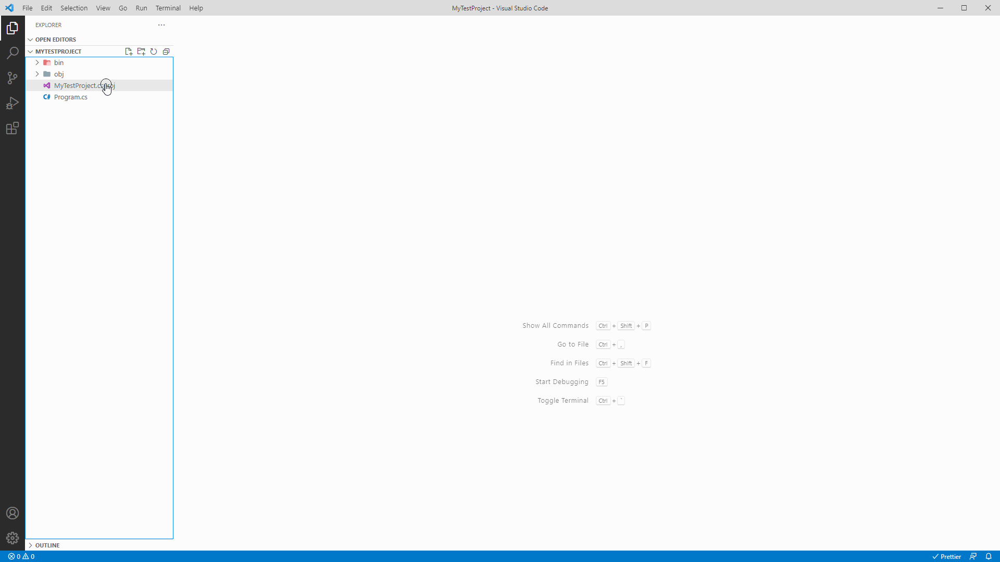

# Visual Nuget

A visual NuGet package manager. Search for, install and uninstall NuGet packages.

### **Need to have dotnet installed. The extension forwards the commands to the dotnet cli.**

### Known issues and missing features

1. Github NuGet registry not supported properly yet. Others probably as well.
2. Lazy loading more results not implemented yet.

## Quick peek

## How to use

Right click on any .csproj, .fsproj or .vbproj file in your workspace and click on the "Visual NuGet: Manage Packages" menu entry.

This will open a panel with the UI to manage your packages. It is very similar to the NuGet Package Manager in Visual Studio.

## Adding new package sources

By default, Visual NuGet only uses nuget.org as a package source but you can add your own, including private ones.

For this you have to go into the setting and add a new item to the list.

Sources are defined by a JSON string with of the following format:  
"{\"name\": \"nuget.org\",\"url\": \"https://api.nuget.org/v3/index.json\", "authorizationHeader": undefined}"

The **name** property is just the friendly name that will be displayed in the UI.  
The **url** property needs to point to the index.json file of the API.  
The **authorizationHeader** is only needed if the source is private and requires authentication/authorization.

To compose the authorizatonHeader check the documentation of the API you want to use as a source.  
It usually is either a "Basic mybase64EncodedUsernameAndPassword" or "Bearer myPersonalPrivateAccessToken".

**Example**  
_Azure DevOps_  
Create a PAT by following the guide [here](https://docs.microsoft.com/en-us/azure/devops/organizations/accounts/use-personal-access-tokens-to-authenticate?view=azure-devops&tabs=Windows#create-a-pat). Make sure to give it **Packaging Read access**.  
With the created PAT base64 encode a string of the following format: VssSessionToken:MyNewlyCreatedPAT  
Compose the **authorizationHeader** like so: "Basic MyBase64EncodedString". It should look something like this: "Basic VnNzU2Vzc2lvblRva2VuOk15TmV3bHlDcmVhdGVkUEFU".  
Use this string when defining the source in the Settings.

## Release notes

### v0.1.3

- minor bug fixes
- code quality improvements

### v0.1.2

- fixed bug where project files in sub-directories were not processed correctly (Installed/Updates did not work)
- added tooltip with full project file path on hover over project name in nav-bar

### v0.1.1

- fixed bug that crashed the extension when used on a project with no installed packages
- fixed issue with dotnet add quoting caused by VS Code bug. (bug is fixed in latest VS Code version)

### v0.1.0

- load metadata for each version
- display version dependencies and published date
- fixed metadata loading for packages with hundreds of versions
- added loading animation to the package list view

### v0.0.5

- semver sorting
- fixed installed/updates tabs for private repos, hope it works for all now
- added status icons on search results showing installed/outdated status

## Any questions or issues?

Don't hesitate to ask on [https://github.com/adrian-pavel/visual-nuget/issues](https://github.com/adrian-pavel/visual-nuget/issues)
